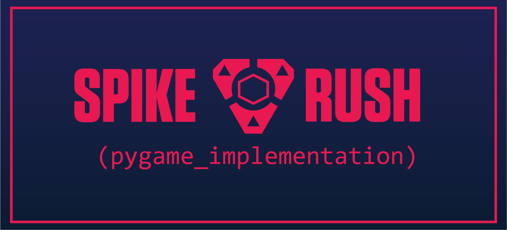

  

## Spike Rush is a top down shooter where players compete by attacking and defending a spike site. A pygame implementation of the Valorant game mode.

## Video

*will be implemented after it's recorded*

      

## Project Goals

Our goal for this project was to implement a working version of the Spike Rush game mode from Valorant. We focused on making a top down version and utilized the pygame module during development. We wanted to ensure the game was highly interactive and fun to play with others.

## Game Overview

Spike Rush is a top down shooter. Before the game begins, players will be able to choose from a selection of guns to use during the game. Players will spawn in designated attack (blue) and defense (red) zones. The attacking player is given a spike, and must plant and detonate it in the spike zone (yellow). The defending player must protect the zone or defuse the spike if it has been planted. The game ends if either player is eliminated or a spike objective is achieved.

## Screenshots

    
*An overview of the game map, based on the Valorant map Split.*

- Shooting screenshot

- Spike close up

      

To play Spike Rush, you will need to download all the files from our 
[Github Repository.](https://github.com/olincollege/spike-rush) You will also
need a version of Python and the Pygame module. Further instructions can be
found [here.](https://github.com/olincollege/spike-rush/blob/main/README.md)

      

### Aditi Vinod  
*Olin Class of 2025*  

this will be a bio           

   

### Andrew Phillips  
*Olin Class of 2025*  

Andrew is a first year student at Olin. Outside of engineering, he enjoys playing video games, going to metal concerts, and hanging out with his dogs.              

### Luke Witten  
*Olin Class of 2025*  

this will be a bio            

## Attribution
Game & logo inspiration from *Valorant* by Riot Games